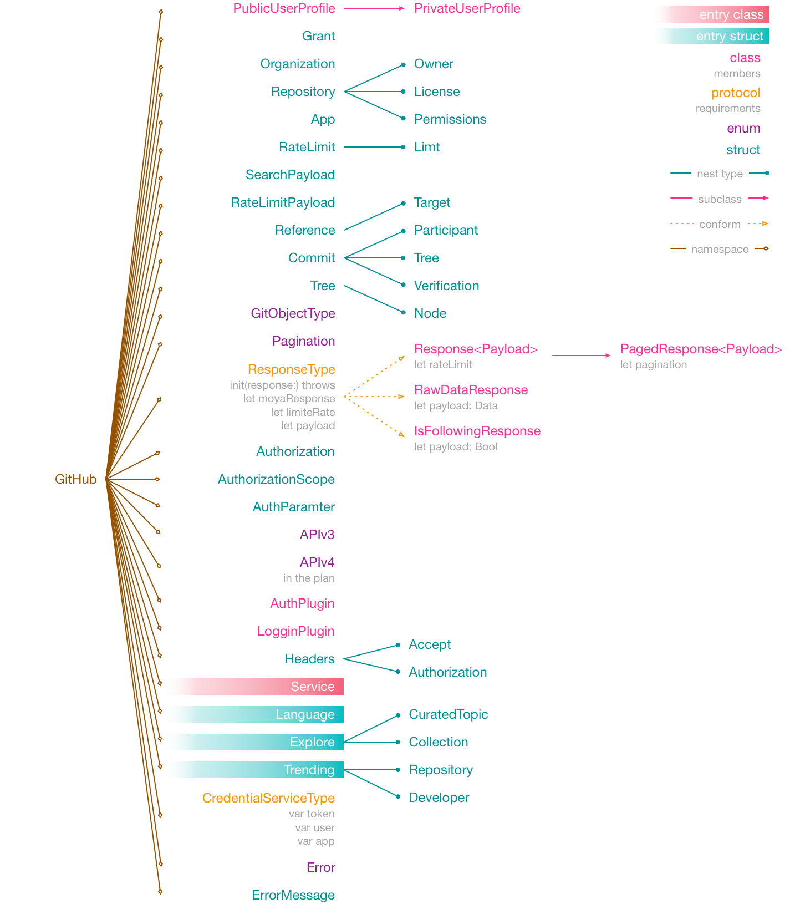
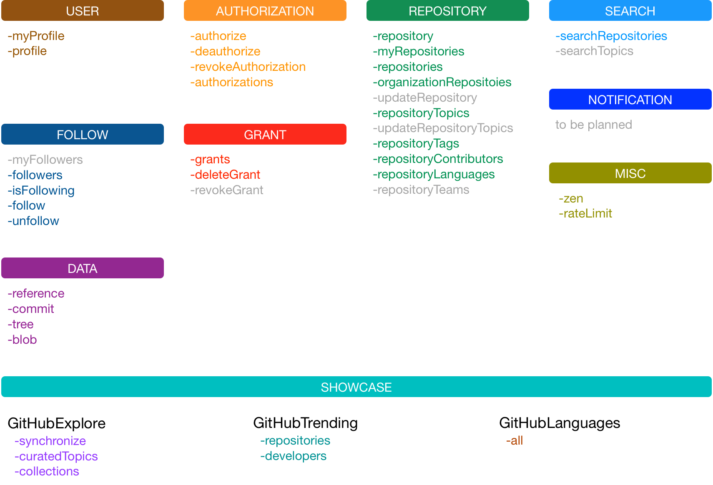

# GitHubKit


[](https://github.com/mudox/github-kit/blob/master/LICENSE)
[](https://travis-ci.com/mudox/github-kit)
[](https://codecov.io/gh/mudox/mudox-kit)
[](https://codeclimate.com/github/mudox/github-kit/maintainability)

GitHubKit is a Swift network layer of the [GitHub APIv3] using [Alamofire] + [Moya] + [RxSwift].

## Type hierarchy

<p align="center">
  
</p>


## Interface

<p align="center">
  
</p>

## Installation

<!--GitHubKit is available through [CocoaPods](http://cocoapods.org). To install-->
<!--it, simply add the following line to your Podfile:-->

GitHubKit is currently not published.

```ruby
pod 'GitHubKit' :git => 'https://github.com/mudox/github-kit.git'
```

## Author

Mudox

## License

GitHubKit is available under the MIT license. See the LICENSE file for more info.

[GitHub APIv3]: https://developer.github.com/v3/
[Moya]: https://github.com/Moya/Moya
[RxSwift]: https://github.com/ReactiveX/RxSwift
[Alamofire]: https://github.com/Alamofire/Alamofire
